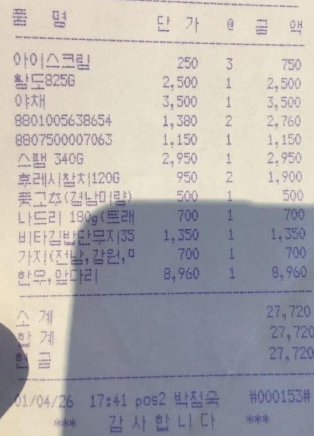

# 🤖 AI Server

<p align="center">
<br>

[//]: # ()
<br>
</p>

## 만든이
<table>
<tbody>
<tr>
<td align="center"><a href="https://github.com/pq5910"><br /><sub><b> 김우정 </b></sub></a><br /></td>
<td align="center"><a href="https://github.com/testjd1"><br /><sub><b> 김재동 </b></sub></a><br /></td>
<td align="center"><a href="https://github.com/lee-JunR"><br /><sub><b> 이준렬 </b></sub></a><br /></td>
</tr>
</tbody>
</table>

## 프로젝트 소개

<p align="justify">
이 프로젝트는 AI 기반 서버 애플리케이션으로, 다양한 AI 모델과 데이터베이스 연동 기능을 제공합니다.
</p>

## 실행 방법

```bash
# 1. 필요한 패키지 설치
pip install -r requirements.txt

# 2. env/.env 에 자신의 DB 와 API key 추가.

# 3. 서버 실행
python app.py

### 3-1. 의존성 에러 발생 시 추가 실행
pip install -U langchain-community
```
구현 기능

- 뉴스 요약 (news_summary.py)
- OCR(광학 문자 인식) (ocr.py)
- 질의 생성 (query_generator.py)
-SQL 실행기 (sql_executor.py)

👥 협업 진행 방식

1. fork 후 dev_{이름}으로 branch 생성 → dev_{이름} 브런치에 merge
2.	이후 각 기능별 main 브런치에 PR 요청 후 합병

🥄 커밋 규칙

태그 : 제목 의 형태이며, : 뒤에만 space가 있음에 유의한다.

- feat : 새로운 기능 추가
- fix : 버그 수정
- docs : 문서 수정
- style : 코드 포맷팅, 세미콜론 누락, 코드 변경이 없는 경우
- refactor : 코드 리펙토링
- test : 테스트 코드, 리펙토링 테스트 코드 추가
- chore : 빌드 업무 수정, 패키지 매니저 수정

🍴 PR 규칙

- PR 제목
예시 : yymmdd {이름} {기능} 구현 (예시 : 240701 이준렬 OCR 구현)

프로젝트 진행 과정에서 배운점, 어려웠던 부분 기록

- 각 기능 구현 시 발생한 문제점과 해결 방법 기록

라이센스

MIT © NoHack 템플릿
